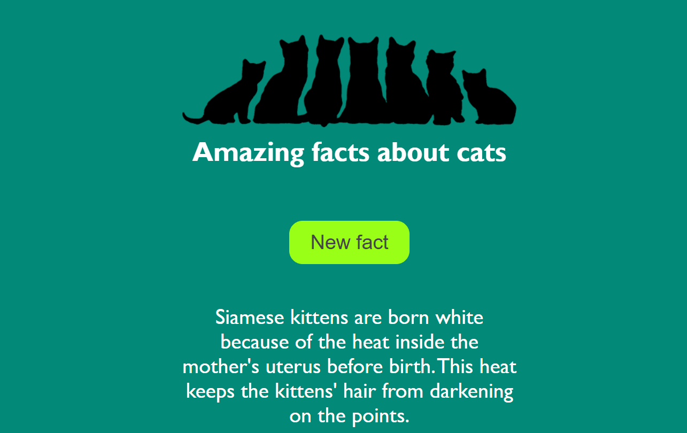

<h1 align="center">
<a href="https://repti85.github.io/Catsapp">
Amazing facts about cats (web app)
</a>
</h1>

https://repti85.github.io/Catsapp/

## Description:
This is my first project ))  
On button click sends a fetch request to catfact.ninja API
 and displays a random fact about cats.

## Features:
- **Responsive layout**
- **Technologies used: HTML, CSS, JavaScript, React**

## Appearance:

